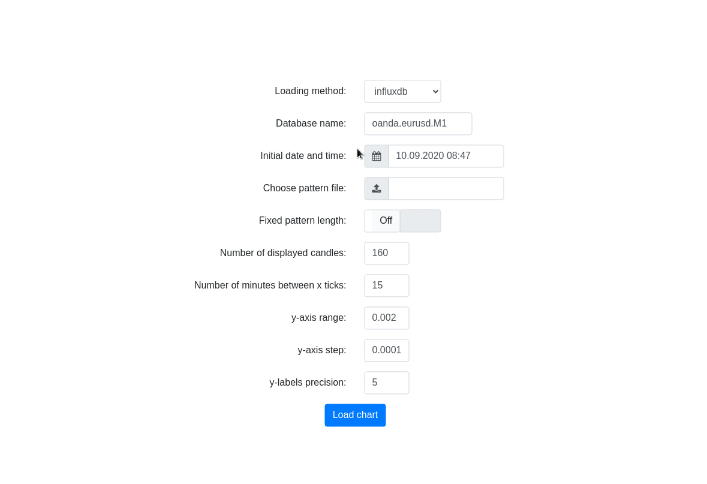

# createPatterns


This Python Flask/D3.js application provides fast and easy way to graphically extract patterns from **candlestick (OHLC) data**.

<p align="center">

</p>

___

## Features

- **bullish** (1) / **bearish** (-1) / **neutral** (0) patterns can be easily marked in a dynamic candlestick plot

- Marked patterns are saved to provided `JSON` file with format:
  ```json
  {
     "startDt": "2019-09-09T10:16:00.000Z",
     "stopDt": "2019-09-09T10:36:00.000Z",
     "dir": "-1"
  }
  ```
  where `startDt` and `stopDt` define pattern timespan (both limits are inclusive).

___

## Usage

### 1. Bind your OHLC data 

Sample interfaces from `file`, `influxdb` are currently implemented.  
Actual loading methods can be found in [dataLoad.py](./dataLoad.py).  
Check the implementation details to grap the whole concept.

<details><summary><b>Or implement your own interface</b></summary>
  <p>
  <ul>
    <li> Actual methods for data loading are implemented in <a href="./dataLoad.py">./dataLoad.py</a>
  <p></p>
  <blockquote>These methods should follow the required structure.</blockquote>
  
  <b>Required parameters:</b>
    <ul>
      <li><code>dtLimit:</code> <code>%Y-%m-%dT%H:%M:%SZ</code> datetime string that delimits given data interval
      <li><code>direction:</code> <code>('left', 'right')</code> string defining direction from dtLimit
      <li><code>noCandles:</code> <code>int</code> defining number of candles to be loaded per request
      <li><code>others:</code> other user-defined parameters
    </ul>
 
  <b>Required return object:</b>
    <ul>
      <li><code>pd.DataFrame</code> with <code>['Date', 'Open', 'High', 'Low', 'Close']</code> columns
      <li><code>Date</code> column contains parsed datetimes
      <li>rows are sorted by ascending <code>Date</code> column
      <li>unknown candles starts with <code>Date</code> followed by <code>np.nan</code> values
    </ul>
  <p></p>
  <li>Loading methods must be referenced in <a href="./data.py#L30-L43">./data.py</a> together with <code>others</code> parameters
  </ul>
</p>
</details>

### 2. Start the app
  `python run.py`

### 3. Set up the environment

| Parameter | Comment |
| -------------:|:------------- |
| Loading method | File / InfluxDB / Your own interface |
| Datafile / Database | Path to file / Database name |
| Initial date and time | .. to use in data loading |
| Pattern file | (Non)empty JSON file to use for saving pattern positions |
| Fixed pattern length | If enabled, patterns contain only defined number of candles |
| Number of displayed candles |  |
| Number of minutes between x ticks |  |
| y-axis range |  |
| y-axis step |  |
| y-labels precision |  |

### 4. Browse OHLC data and mark your desired patterns!

___

## License

This project is licensed under the terms of the [MIT](./LICENSE) license.
